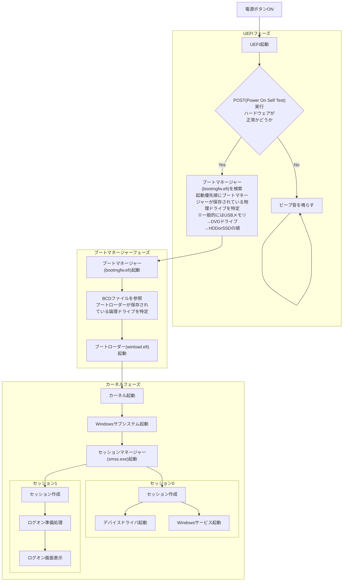

## 概要
* カーネル（OS）
* ブートマネージャー（OSを起動するためのプログラム）
* UEFI（OS起動前のハードウェアのチェック）



## UEFI (Unified Extensible Firmware Interface)
* OSが起動する前にパソコンに搭載されているハードウェアを制御しOSを起動させるプログラム
* マザーボード上のUEFI専用のフラッシュメモリに格納されている
* UEFIで保存された情報は、メインメモリには保存されず、マザーボード上のUEFI専用のRAMに保存される（※ボタン電池で稼働している）
* BIOSとの違い：OSやハードウェアの技術進歩についていけなくなり進化したのがUEFI
* 物理ドライブしか認識できない

## ブートマネージャー (bootmgfw.efi)
* UEFIから起動されるブートローダーを起動するためのプログラム
* 論理ドライブを認識できる

## ブートローダー (winload.efi)
* ブートマネージャーから起動されるカーネルを起動するためのプログラム

## BCDファイル (Boot Configuration Data ブート構成データ)
* ブートローダーを起動するために記載されている設定情報
* 例
```console
PS C:\WINDOWS\system32> bcdedit
Windows ブート マネージャー
--------------------------------
identifier              {bootmgr}
device                  partition=\Device\HarddiskVolume3
path                    \EFI\Microsoft\Boot\bootmgfw.efi
description             Windows Boot Manager
locale                  ja-JP
inherit                 {globalsettings}
default                 {current}
resumeobject            {********-****-****-****-***********}
displayorder            {current}
toolsdisplayorder       {memdiag}
timeout                 30
Windows ブート ローダー
--------------------------------
identifier              {current}
device                  partition=C:
path                    \WINDOWS\system32\winload.efi
description             Windows 10
locale                  ja-JP
inherit                 {bootloadersettings}
recoverysequence        {********-****-****-****-***********}
displaymessageoverride  Recovery
recoveryenabled         Yes
isolatedcontext         Yes
allowedinmemorysettings 0x15000075
osdevice                partition=C:
systemroot              \WINDOWS
resumeobject            {********-****-****-****-***********}
nx                      OptIn
bootmenupolicy          Standard
hypervisorlaunchtype    Auto
```

## カーネル
* OSのコア部分のプログラム（メモリ、CPUを操作）

## Windowsサブシステム
* 環境サブシステムプロセス (Csrss.exe)
　プロセス、スレッドの生成削除など
* WindowsAPI群 (Windowsの機能をプログラムから使用可能)

## セッションマネージャー (smss.exe)
* アプリケーションが動作するプロセス空間を分ける仕組み
  ※プロセス空間内ではアプリ間を跨いで同じメモリ空間を共有可能
* 元々は最初にログオンしたユーザもOS起動時のドライバやWindowsサービスも同一セッションで稼働していたが、
　WindowsVISTAから、より堅牢なセキュリティを考慮してセッションが分割された
* 別ユーザがログオンすると新規セッションが作成される

## ユーザーモードとカーネルモードについて
* カーネルモード：カーネルへ直接アクセス可能
* ユーザーモード：カーネルへ直接アクセス不可（※カーネルへのアクセスはWindowsApiを通す必要がある）

## 参考文献
### ブート シーケンスのフローチャート
https://docs.microsoft.com/ja-jp/windows/client-management/img-boot-sequence
### Windows セッション マネージャーとは何か
https://tooljp.com/Windows10/doc/ProcessName-in-TaskManager/html/WindowsSessionManager.html
