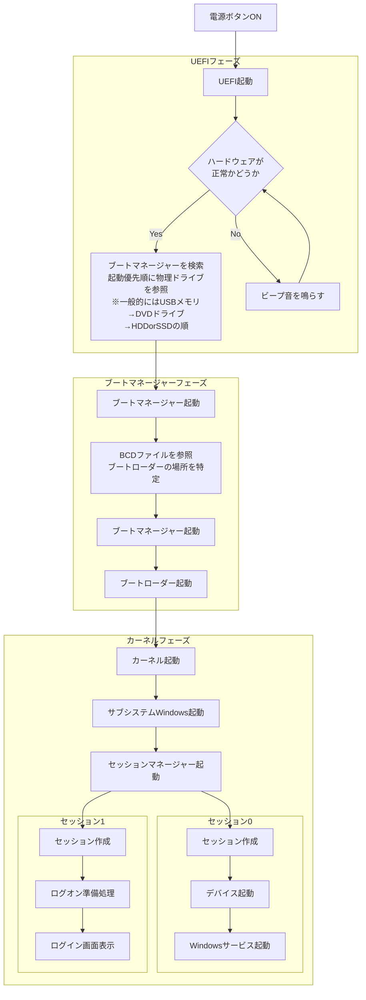

<!--   subgraph セッション０
  P["セッション０起動"]-->aaaa
  end
  subgraph セッション１
  Q["ログオン画面起動"]-->bbbb
  end -->

## UEFI (Unified Extensible Firmware Interface)
* OSが起動する前にパソコンに搭載されているハードウェアを制御しOSを起動させるプログラム
* マザーボード上のUEFI専用のフラッシュメモリに格納されている
* UEFIで保存された情報は、メインメモリには保存されず、マザーボード上のUEFI専用のRAMに保存される（※ボタン電池で稼働している）
* BIOSとの違い：OSやハードウェアの技術進歩についていけなくなり進化したのがUEFI

## ブートマネージャー
* UEFIから起動されるブートローダーを起動するためのプログラム

## BCDファイル (Boot Configuration Data ブート構成データ)
* ブートローダーを起動するために記載されている設定情報
* 例
```console
PS C:\WINDOWS\system32> bcdedit
Windows ブート マネージャー
--------------------------------
identifier              {bootmgr}
device                  partition=\Device\HarddiskVolume3
path                    \EFI\Microsoft\Boot\bootmgfw.efi
description             Windows Boot Manager
locale                  ja-JP
inherit                 {globalsettings}
default                 {current}
resumeobject            {********-****-****-****-***********}
displayorder            {current}
toolsdisplayorder       {memdiag}
timeout                 30
Windows ブート ローダー
--------------------------------
identifier              {current}
device                  partition=C:
path                    \WINDOWS\system32\winload.efi
description             Windows 10
locale                  ja-JP
inherit                 {bootloadersettings}
recoverysequence        {********-****-****-****-***********}
displaymessageoverride  Recovery
recoveryenabled         Yes
isolatedcontext         Yes
allowedinmemorysettings 0x15000075
osdevice                partition=C:
systemroot              \WINDOWS
resumeobject            {********-****-****-****-***********}
nx                      OptIn
bootmenupolicy          Standard
hypervisorlaunchtype    Auto
```

## ブートローダー
* ブートマネージャーから起動されるカーネルを起動するためのプログラム

## セッションマネージャー
* アプリケーションが動作するプロセス空間を分ける仕組み
  ※プロセス空間内ではアプリ間を跨いで同じメモリ空間を共有可能
* 元々は最初にログオンしたユーザもOS起動時のドライバやWindowsサービスも同一セッションで稼働していたが、
　より堅牢なセキュリティを考慮してセッションが分割された
※ プロセスエクスプローラーで確認可能
* 別ユーザがログオンすると新規セッションが作成される
