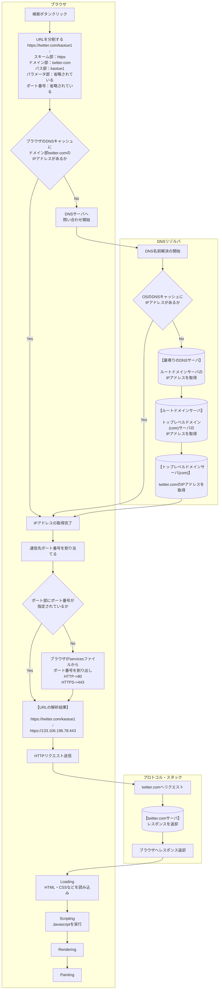

# 概要
1. DNS
2. Webリクエスト
3. 画面表示

<br>

1. ブラウザの検索ボタンクリック
1. URLを解読
1. キャッシュにIPアドレスがあるか確認
1. DNSからIPアドレスを取得
1. ポート番号を割り当てる
1. IPアドレスでサーバーにリクエストを実行
1. HTTPリクエストを送信する
1. HTTPレスポンスを受信する
1. レンダリング



## URL (Uniform Resource Locator)
インターネット上のリソースを一意に特定するための名前

## DNS (Domain Name System)
IPアドレスとドメインを関連して管理する仕組み

## 国際化ドメイン名
英数字以外の、漢字、アラビア文字、キリル文字、ギリシア文字などを使用したドメイン名<br>
※例 日本語.jp

## 国際化ドメイン名のDNSについて
Punycodeという、国際化ドメインのUnicode文字をDNSで使える文字を使ってエンコードする符号化方式を使用して<br>
変換後にいつも通りのDNSの名前解決を実施する<br>
ブラウザ側でのエンコード対応だけなので、国際化ドメイン名が対応時にDNSの仕様変更は一切行われなかった。<br>
<br>
https://punycode.jp/<br>
正規化後	:	日本語.jp<br>
Punycode	:	xn--wgv71a119e.jp<br>

## Socketライブラリ
OSに組み込まれているネットワーク機能をアプリケーション(ブラウザなど)から呼び出すためのプログラム群

## DNSリゾルバ
Socketライブラリの中の一プログラム
DNSの名前解決を実行するプログラム

## プロトコル・スタック
OSに組み込まれているネットワーク制御用のプログラム


## servicesファイル
スキーマ→第４層のプロトコル、ポート番号の対応表が載っているファイル<br>
ポート番号を指定していない場合、ブラウザからはポート番号のみ取得
### Windows
C:\Windows\System32\drivers\etc\services
```console
# Copyright (c) 1993-2004 Microsoft Corp.
#
# This file contains port numbers for well-known services defined by IANA
#
# Format:
#
# <service name>  <port number>/<protocol>  [aliases...]   [#<comment>]
#
http               80/tcp    www www-http           #World Wide Web
https             443/tcp    MCom                   #HTTP over TLS/SSL
https             443/udp    MCom                   #HTTP over TLS/SSL
```
### Mac
/etc/services
```console
/etc % cat services 
#
# Network services, Internet style
#
# Note that it is presently the policy of IANA to assign a single well-known
# port number for both TCP and UDP; hence, most entries here have two entries
# even if the protocol doesn't support UDP operations.
#
# The latest IANA port assignments can be gotten from
#
#	http://www.iana.org/assignments/port-numbers
#
# The Well Known Ports are those from 0 through 1023.
# The Registered Ports are those from 1024 through 49151
# The Dynamic and/or Private Ports are those from 49152 through 65535
#
# $FreeBSD: src/etc/services,v 1.89 2002/12/17 23:59:10 eric Exp $
#	From: @(#)services	5.8 (Berkeley) 5/9/91
#
# WELL KNOWN PORT NUMBERS
#
#                          David Zimmerman <dpz@RUTGERS.EDU>
http             80/udp     www www-http # World Wide Web HTTP
http             80/tcp     www www-http # World Wide Web HTTP
#                          Bill Davidson <billd@equalizer.cray.com>
https           443/udp     # http protocol over TLS/SSL
https           443/tcp     # http protocol over TLS/SSL
```
