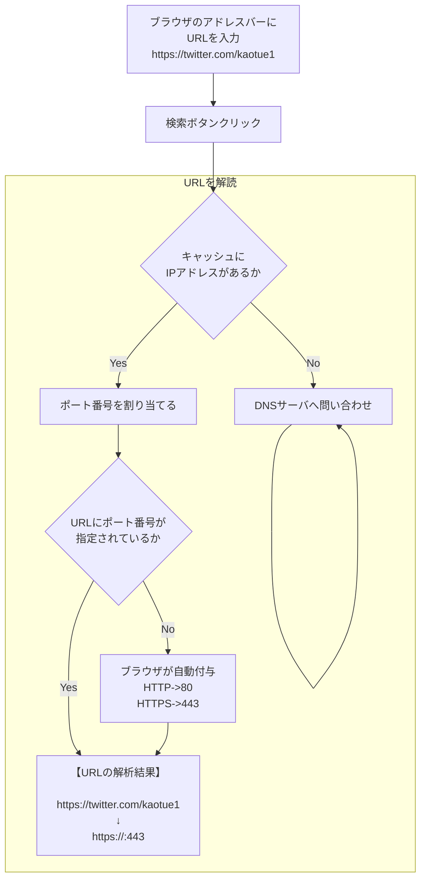

1. ブラウザの検索ボタンクリック
1. URLを解読
1. キャッシュにIPアドレスがあるか確認
1. DNSからIPアドレスを取得
1. IPアドレスでサーバーにリクエストを実行
1. ポート番号を割り当てる
1. HTTPリクエストを送信する
1. HTTPレスポンスを受信する
1. レンダリング

## URL (Uniform Resource Locator)
インターネット上のリソースを一意に特定するための名前

## DNS (Domain Name System)
IPアドレスとドメインを関連して管理する仕組み
